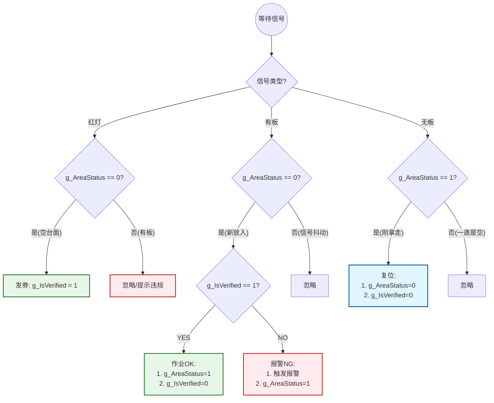

这份文档汇总了我们讨论确定的最终方案。您可以直接复制保存为 `.md` 文件，或打印出来作为 LogicAgent 的配置指导书。

该方案的核心是引入 **“状态锁（Edge Detection）”** 机制，解决工业相机持续信号导致的状态死循环问题，确保 SOP 流程严格闭环。

---

# 工业视觉 SOP 检测方案：电感笔校验闭环逻辑

## 1. 需求概述 (SOP Requirements)

**目标**：确保操作员严格遵循“先空台校验，后放板测试”的作业流程。

**核心规则**：

1. **准入**：只有在“无板”状态下校验电感笔（亮红灯），才发放“入场券”。
2. **生产**：放置板件时，系统检查是否有“入场券”。有则OK，无则报警。
3. **复位**：板件一旦移走，入场券立即作废，强制下一次作业前必须重新校验。
4. **严控**：禁止在有板状态下校验；禁止未校验直接放板。

---

## 2. 变量定义 (Global Variables)

在 LogicAgent “变量管理”中创建以下两个全局整型变量（Int）：

| 变量名 | 初始值 | 含义 | 逻辑作用 |
| --- | --- | --- | --- |
| **`g_IsVerified`** | `0` | **校验通行证** | `0`: 未校验/失效 

 `1`: 已校验 (持有入场券) |
| **`g_AreaStatus`** | `0` | **区域状态锁** | `0`: 系统判定当前为空 

 `1`: 系统判定当前被占用 

 *(用于实现上升沿/下降沿判断)* |

---

## 3. 逻辑编排流程 (Logic Implementation)

请在画布中配置三个并行的事件流。

### 流程一：校验电感笔（领券）

> **场景**：操作员对着空台面按压电感笔。

1. **[事件匹配]**：匹配标签 `红灯 (RedLight)`。
2. **[数值比较]**：判断 `g_AreaStatus == 0` （当前是空台面吗？）
* **YES (合规)**  **[变量赋值]** `g_IsVerified = 1`
* **NO (违规)**  空操作（或语音提示“请移走板件”）

### 流程二：移走板件（复位 & 销券）

> **场景**：测试结束，操作员拿走板件。此流程包含关键的**“下降沿”**判断。

1. **[事件匹配]**：匹配标签 `无板 (NoBoard)`。
2. **[数值比较]**：判断 **`g_AreaStatus == 1`** （**关键锁**：确认系统记忆里之前是“有板”状态？）
* **YES (确实刚拿走)**  执行复位：
1. **[变量赋值]** `g_AreaStatus = 0` （解锁区域）
2. **[变量赋值]** `g_IsVerified = 0` （销毁旧券）

* **NO (一直是空的)**  忽略（防止相机持续发无板信号导致死循环）

### 流程三：放入板件（核销 & 生产）

> **场景**：操作员放入板件开始测试。此流程包含关键的**“上升沿”**判断。

1. **[事件匹配]**：匹配标签 `有板 (HasBoard)`。
2. **[数值比较]**：判断 `g_AreaStatus == 0` （**防抖锁**：确认这是新放入的动作？）
* **YES (新动作)**  进入核心校验：
* **[数值比较]**：判断 `g_IsVerified == 1` （有通行证吗？）
* **YES (有券/OK)** 
1. **[变量赋值]** `g_IsVerified = 0` （核销通行证）
2. **[变量赋值]** `g_AreaStatus = 1` （**锁定区域**）
3. **[输出]** 界面显示 OK

* **NO (无券/NG)** 
1. **[报警控件]** 触发报警 / NG
2. **[变量赋值] `g_AreaStatus = 1**` （**重要**：即使违规，板子也占用了台面，必须锁定状态，否则拿走时无法触发复位）

* **NO (信号抖动)**  忽略

---

## 4. 逻辑流程图 (Visual Flowchart)

---

## 5. 实现原理说明 (Why this works)

### 为什么需要 `g_AreaStatus`？

工业相机是持续输出信号的（例如每秒输出10次“无板”）。如果不加 `g_AreaStatus` 进行状态锁定：

1. 当你拿走板件时，逻辑会执行第1次复位（正确）。
2. 但相机还在持续输出“无板”，逻辑会执行第2次、第3次...第N次复位。
3. **后果**：当你校验完电感笔（g_IsVerified=1）准备放板时，相机的“无板”信号还在触发复位逻辑，瞬间就把你的校验状态（g_IsVerified）清零了，导致合法操作被误报。

### 状态锁的作用

* **上升沿触发**：`有板` + `g_AreaStatus==0`  捕捉“放入”的瞬间。
* **下降沿触发**：`无板` + `g_AreaStatus==1`  捕捉“拿走”的瞬间。

这种机制将持续的**电平信号**转换为了单次的**脉冲动作**，是工业自动化控制的标准做法。